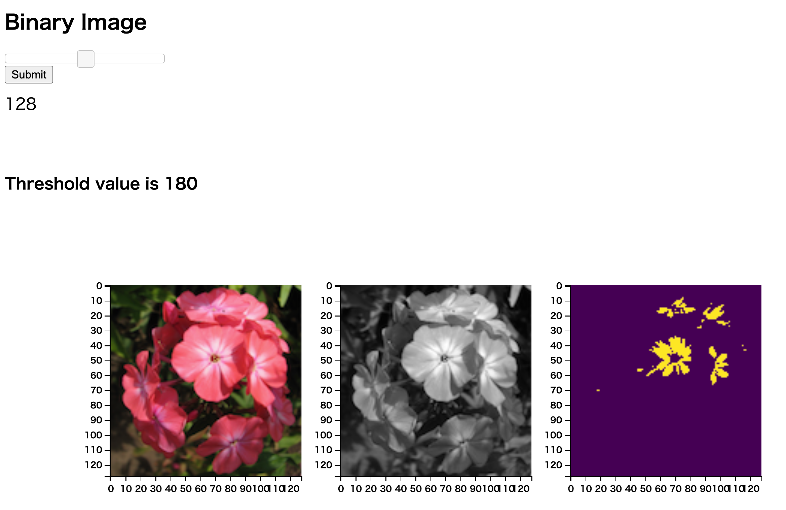

# tz_flask_20230313_binary2
* create binary image
* add slider 
* can use slider to select threshold value only once
* canot use slider twice or more (NEGATIVE POINT)

## how to deploy
- static/sample.png
- templates/index.html
- app.py

## view

